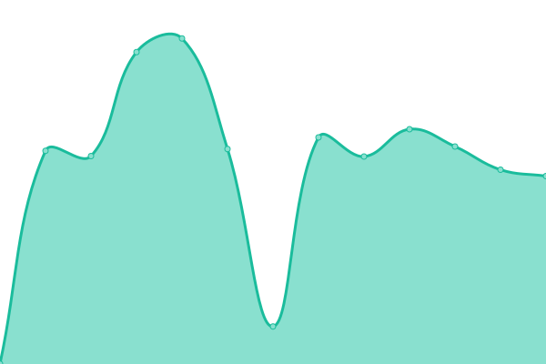
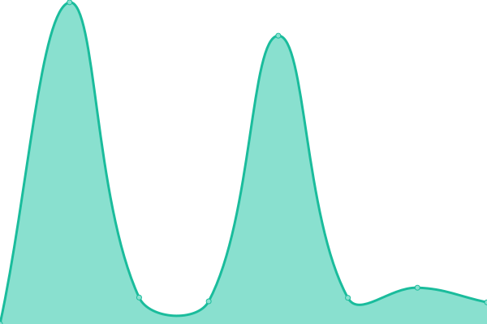

# [📈 Live Status](https://ngc7331.github.io/upptime): <!--live status--> **🟧 Partial outage**

This repository contains the open-source uptime monitor and status page for [ngc7331](https://ngc7331.github.io/upptime), powered by [Upptime](https://github.com/upptime/upptime).

With [Upptime](https://upptime.js.org), you can get your own unlimited and free uptime monitor and status page, powered entirely by a GitHub repository. We use [Issues](https://github.com/ngc7331/upptime/issues) as incident reports, [Actions](https://github.com/ngc7331/upptime/actions) as uptime monitors, and [Pages](https://ngc7331.github.io/upptime) for the status page.

<!--start: status pages-->
<!-- This summary is generated by Upptime (https://github.com/upptime/upptime) -->
<!-- Do not edit this manually, your changes will be overwritten -->
<!-- prettier-ignore -->
| URL | Status | History | Response Time | Uptime |
| --- | ------ | ------- | ------------- | ------ |
|  [Orange](https://isorangealive.ngc7331.site) | 在线 | [orange.yml](https://github.com/ngc7332/upptime/commits/HEAD/history/orange.yml) | 

 212ms
     
 | 

<a href="https://ngc7332.github.io/upptime/history/orange">100.00%</a>
    

|  Red | 离线 | [red.yml](https://github.com/ngc7332/upptime/commits/HEAD/history/red.yml) | 

 1628ms
     
 | 

<a href="https://ngc7332.github.io/upptime/history/red">100.00%</a>
    

|  Onedrive(Microsoft) | 在线 | [onedrive-microsoft.yml](https://github.com/ngc7332/upptime/commits/HEAD/history/onedrive-microsoft.yml) | 

 336ms
     
 | 

<a href="https://ngc7332.github.io/upptime/history/onedrive-microsoft">100.00%</a>
    

<!--end: status pages-->

[**Visit our status website →**](https://ngc7331.github.io/upptime)

## 📄 License

- Code: [MIT](./LICENSE) © [ngc7331](https://ngc7331.github.io/upptime)
- Data in the `./history` directory: [Open Database License](https://opendatacommons.org/licenses/odbl/1-0/)
