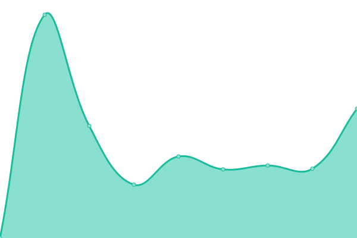
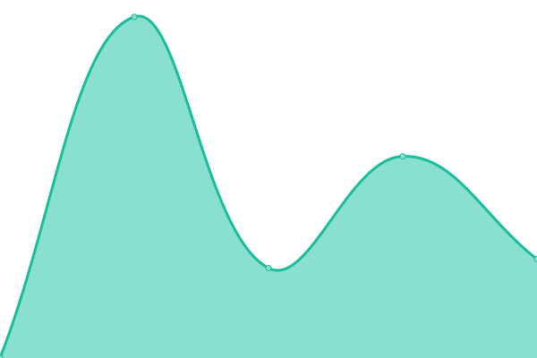
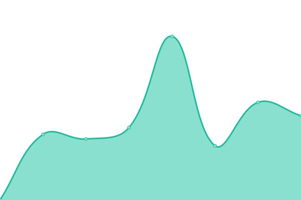

# [📈 Live Status](https://ngc7331.github.io/upptime): <!--live status--> **🟧 Partial outage**

This repository contains the open-source uptime monitor and status page for [ngc7331](https://ngc7331.github.io/upptime), powered by [Upptime](https://github.com/upptime/upptime).

With [Upptime](https://upptime.js.org), you can get your own unlimited and free uptime monitor and status page, powered entirely by a GitHub repository. We use [Issues](https://github.com/ngc7331/upptime/issues) as incident reports, [Actions](https://github.com/ngc7331/upptime/actions) as uptime monitors, and [Pages](https://ngc7331.github.io/upptime) for the status page.

<!--start: status pages-->
<!-- This summary is generated by Upptime (https://github.com/upptime/upptime) -->
<!-- Do not edit this manually, your changes will be overwritten -->

| URL                                      | Status | History                                                                                                                                      | Response Time                                                                                            | Uptime                                                                                                                                                                                                                                                                |
| ---------------------------------------- | ------ | -------------------------------------------------------------------------------------------------------------------------------------------- | -------------------------------------------------------------------------------------------------------- | --------------------------------------------------------------------------------------------------------------------------------------------------------------------------------------------------------------------------------------------------------------------- |
| [Blog](https://ngc7331.top:4443)         | 在线   | [blog.yml](https://github.com/ngc7331/upptime/commits/master/history/blog.yml)                                                               |  2940ms                               |                                                               |
| [Nextcloud](https://nc.ngc7331.top:4443) | 在线   | [nextcloud.yml](https://github.com/ngc7331/upptime/commits/master/history/nextcloud.yml)                                                     |  2487ms                          |                                                     |
| Onedrive-Programs                        | 在线   | [onedrive-programs.yml](https://github.com/ngc7331/upptime/commits/master/history/onedrive-programs.yml)                                     |  3405ms                  |                                     |
| Onedrive-Programs-Backend(Microsoft)     | 在线   | [onedrive-programs-backend-microsoft.yml](https://github.com/ngc7331/upptime/commits/master/history/onedrive-programs-backend-microsoft.yml) |  863ms |  |
| Red                                      | 离线   | [red.yml](https://github.com/ngc7331/upptime/commits/master/history/red.yml)                                                                 |  351ms                                 |                                                                  |

<!--end: status pages-->

[**Visit our status website →**](https://ngc7331.github.io/upptime)

## 📄 License

- Code: [MIT](./LICENSE) © [ngc7331](https://ngc7331.github.io/upptime)
- Data in the `./history` directory: [Open Database License](https://opendatacommons.org/licenses/odbl/1-0/)
